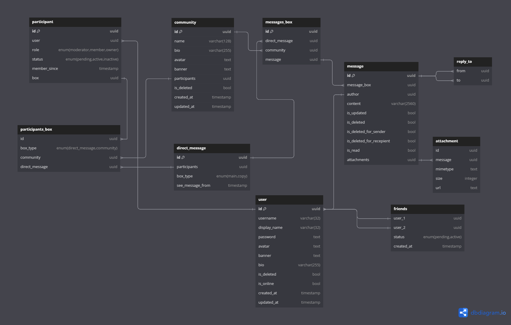

# Octoconvo

## What is Octoconvo?

Octoconvo is a social chatting application centered on connectivity and engaging user interactions, creating playful
and fun social communities where users can chat and interact with each other, hang out, and have fun conversations.
Octonvo focuses on features that provide a fun user experience ensuring a playful social environment. It is a social
chatting application to make friends, chat, and more.

## Features

- User authentication with options to use either Google Oauth or create a new Octoconvo account.
- Direct message for one-on-one conversation.
- Create community where users can search and invite other users to join.
- CRUD implementation to let users create, read, update, and delete their account, messages, and community.
- Search functionality to search for other users with their username.
- Search functionality to search for public communities.
- Real-time chat and notification functionality.
- Share jpg, jpeg, png, or gifs in chat.
- User profile page that allows users to customize their profile username, display name, avatar, picture banner and bio.
- Community profile page that allows the community creator to customize community name, community avatar, banner, and
  bio.
- Infinite scrolling functionality to load messages.

## Database Schema design

### Entity-Relationship Diagram (ERD)

### key points

- Friend requests.
- unilateral deletion of messages on direct message or direct message box without affecting the other user.
- read indicator for users to see if messages has been read on direct message box.
- activity indicator to show wether a user is currently online.

### Key point approach

**Friend request**

Use status fields to check for pending friends table with the user id.

**Unilateral deletion**

Use see_message_from to hide messages before the specified timestamp.

**Direct message read indicator**

Use is_read field to check message read status to update if the other participant request HTTP GET to the message.

**Online activity indicator**

Use last_seen to check for users last activity date. If user last activity date is less than five minutes mark user as active.
